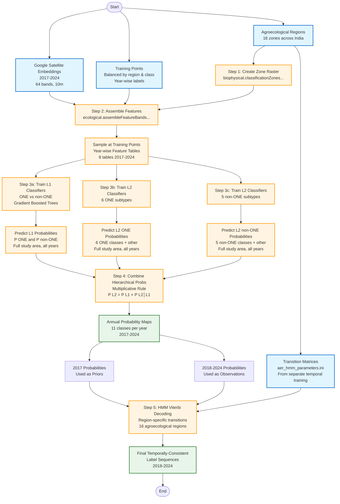

# Temporally-Consistent Probabilistic Landcover Classification for India's Open Natural Ecosystems

Annual time-series landcover maps (2017-2024) at 10m resolution using hierarchical classification and Hidden Markov Model-based temporal consistency.

---

## Table of Contents

- [Conceptual Framework](#conceptual-framework)
  - [What This Repository Does](#what-this-repository-does)
  - [Our Approach](#our-approach)
  - [Input Data](#input-data)
  - [Stage 1: Probabilistic Classification](#stage-1-probabilistic-classification)
  - [Stage 2: Hierarchical Classification](#stage-2-hierarchical-classification)
  - [Label Hierarchy](#label-hierarchy)
  - [Stage 3: Temporal Consistency](#stage-3-temporal-consistency)
  - [Outputs](#outputs)
- [Workflow Flowchart](#workflow-flowchart)
- [Reproducible Workflow](#reproducible-workflow)
  - [Prerequisites](#prerequisites)
  - [Setup](#setup)
  - [Configuration](#configuration)
  - [Step-by-Step Workflow](#step-by-step-workflow)
  - [Module Reference](#module-reference)
  - [Output Specifications](#output-specifications)

---

## Conceptual Framework

### What This Repository Does

This repository produces temporally-consistent annual landcover maps from 2018 to 2024 across 17 Indian states at 10m resolution. The output includes:

1. **Annual probability maps**: Full probability distributions across 11 landcover classes for each year
2. **Temporally-consistent labels**: Discrete landcover classifications that are statistically smoothed across the time series to reduce spurious transitions while preserving genuine landscape change

The classification distinguishes 11 landcover types, with particular emphasis on accurately mapping India's Open Natural Ecosystems (ONEs)—6 types including grassland savanna, shrubland savanna, woodland savanna, and other non-forest ecosystems that are often misclassified or overlooked in conventional landcover products.

**Geographic Coverage**: 17 Indian states
**Temporal Coverage**: 2017-2024 (8 years)
**Spatial Resolution**: 10m pixel size
**Classification Scheme**: 11 classes organized in a 2-level hierarchy

---

### Our Approach

We produce annual landcover maps through a three-stage process that combines probabilistic hierarchical classification with temporal consistency enforcement.

---

### Input Data

**Satellite Features**:
- **Google Satellite Embeddings** (2017-2024): 64-band learned representations from Google's deep learning model, capturing spectral, textural, and contextual information at 10m resolution
- **Agroecological Regions**: Zonation layer with 16 regions across India, used to stratify classification and account for regional variation in landcover patterns
- **Spatial Coordinates**: Longitude and latitude for each pixel, providing geographic context

**Training Data**:
- **Temporal coverage**: Year-wise labeled samples for 2017-2024
- **Spatial balance**: Stratified across 16 agroecological regions to ensure representation of India's diverse landscapes
- **Class balance**: Balanced across all 11 landcover types to prevent classifier bias toward dominant classes
- **Source**: Assembled from publicly available landcover masks and reference layers (see [`trainingData/`](trainingData/) folder)

**Study Area**:
- **States**: Delhi, Punjab, Uttar Pradesh, Haryana, Rajasthan, Gujarat, Maharashtra, Madhya Pradesh, Chhattisgarh, Jharkhand, Bihar, Telangana, Andhra Pradesh, Tamil Nadu, Karnataka, Goa, West Bengal
- **Resolution**: 10m pixel size
- **Projection**: EPSG:24343 (UTM zone 43N) for export

---

### Stage 1: Probabilistic Classification

Rather than producing only discrete class labels, we generate full probability distributions for each pixel.

**Key Design Choice**: Our classifiers output probabilities for all possible landcover classes, not just a single "best guess" label. This probabilistic output captures classification uncertainty and enables more sophisticated downstream processing.

**Why probabilities matter**:
- A pixel with probabilities [forest: 0.51, shrubland: 0.49] is fundamentally different from [forest: 0.99, shrubland: 0.01], even though both would be labeled "forest" in a discrete classification
- Probability distributions allow us to identify ambiguous pixels and propagate uncertainty through subsequent analysis
- Temporal smoothing (Stage 3) leverages these probabilities to make statistically informed decisions about label sequences

**Technical Implementation**:
- **Classifier**: Gradient Boosted Trees (`ee.Classifier.smileGradientTreeBoost`)
- **Configuration**: 150 trees, 500 maximum nodes per tree
- **Training split**: 70% of samples used for training, 30% held out (note: the 30% validation holdout has not been used for formal validation in this analysis)
- **Output mode**: `MULTIPROBABILITY` - produces probability distributions rather than hard classifications
- **Storage**: Probabilities scaled by 10,000 and stored as uint16 for efficiency (divide by 10,000 to recover actual probabilities)

---

### Stage 2: Hierarchical Classification

We employ an explicitly hierarchical approach that breaks the 11-class problem into smaller, more manageable sub-problems organized by a classification tree.

**Hierarchical Strategy**: Instead of training a single classifier to distinguish all 11 classes simultaneously, we:
1. First classify pixels into broad categories (Level 1)
2. Then specialize classifiers for detailed types within each broad category (Level 2)
3. Mathematically merge the hierarchical predictions to obtain final 11-class probabilities

**Why hierarchical?** This approach improves accuracy by:
- Allowing each classifier to focus on distinguishing between fewer, more closely related classes
- Incorporating prior knowledge about landcover relationships (e.g., grassland savanna and shrubland savanna are more similar to each other than to built-up areas)
- Reducing classification errors through structured decision-making

---

### Label Hierarchy

Our classification uses a 2-level hierarchy with 11 landcover classes at the finest level:

```
Level 0: Landcover (root)
├─ Level 1: non-ONE (code: 100)
│  ├─ Level 2: agri_open (1)              - Agriculture and open lands
│  ├─ Level 2: built (3)                  - Built-up areas
│  ├─ Level 2: cultivated_trees (4)       - Plantations and orchards
│  ├─ Level 2: forest (6)                 - Closed-canopy forests
│  └─ Level 2: water_wetland (11)         - Water bodies and wetlands
└─ Level 1: ONE (code: 200)
   ├─ Level 2: bare_rocky (2)             - Bare ground and rocky terrain
   ├─ Level 2: dunes (5)                  - Sand dunes
   ├─ Level 2: saline_flat (7)            - Salt flats and saline areas
   ├─ Level 2: savanna_grass (8)          - Grassland savanna
   ├─ Level 2: savanna_shrub (9)          - Shrubland savanna
   └─ Level 2: savanna_tree (10)          - Woodland savanna
```

**Numeric codes** in parentheses correspond to the values in output rasters and are defined in [`labelHierarchy.json`](labelHierarchy.json).

---

#### Three Classifiers and Probability Merging

For each year, we train **3 classifiers**:

**1. Level 1 Classifier (ONE vs non-ONE)**
- **Input**: 64 satellite embedding bands + agroecological zone + coordinates
- **Task**: Distinguish Open Natural Ecosystems (ONE) from non-ONE landcover
- **Output**: 2-band probability raster
  - `prob_one`: Probability pixel is an ONE
  - `prob_nonone`: Probability pixel is non-ONE

**2. Level 2 Classifier (ONE subtypes)**
- **Input**: Same features, trained on the full training dataset
- **Task**: Distinguish among 6 ONE subtypes (bare_rocky, dunes, saline_flat, savanna_grass, savanna_shrub, savanna_tree) and 1 aggregate non-ONE subtype
- **Output**: 7-band probability raster
  - 6 bands for the 6 ONE classes
  - 1 aggregate band for "other" (representing non-ONE pixels, used for probability readjustment)

**3. Level 2 Classifier (non-ONE subtypes)**
- **Input**: Same features, trained on the full training dataset
- **Task**: Distinguish among 5 non-ONE subtypes (agri_open, built, cultivated_trees, forest, water_wetland) and 1 aggregate ONE subtype
- **Output**: 6-band probability raster
  - 5 bands for the 5 non-ONE classes
  - 1 aggregate band for "other" (representing ONE pixels, used for probability readjustment)

**Mathematical Merging: Multiplicative Hierarchical Rule**

We combine the hierarchical predictions using an explicit multiplicative approach:

For each Level 2 class, the final probability is calculated as:

```
P(Level 2 class) = P(Level 1 parent) × P(Level 2 class | Level 1 parent)
```

**For example**:
- `P(savanna_grass) = P(ONE) × P(savanna_grass | ONE)`
- `P(forest) = P(non-ONE) × P(forest | non-ONE)`

**Readjustment step**: Before multiplication, Level 1 probabilities are readjusted to account for the "other" class probabilities at Level 2:
```
P(ONE)_readjusted = P(ONE) × (1 - P(other | ONE))
P(non-ONE)_readjusted = P(non-ONE) × (1 - P(other | non-ONE))
```

These readjusted L1 probabilities are then renormalized to sum to 1.0, and the multiplicative rule is applied.

**Final output**: After multiplication and normalization, we obtain a full 11-class probability distribution for each pixel, where all probabilities sum to 1.0. We also identify the top-1 label (class with maximum probability) for each pixel.

**Scale**: 3 classifiers per year × 8 years = **24 models total**

---

### Stage 3: Temporal Consistency

#### The Challenge of Temporal Noise

Annual landcover classification faces a fundamental temporal consistency problem: classifying each year independently can produce implausible year-to-year transitions.

**The Problem**: Machine learning classifiers make errors. When we classify each year separately, random classification errors create impossible or highly unlikely landcover transitions. For example:
- A stable forest pixel might be misclassified as cropland for one year, then correctly classified as forest the following year
- A grassland savanna pixel might flip between grassland savanna and shrubland savanna labels across consecutive years due to subtle seasonal differences in the satellite imagery

**Why It Matters**: These spurious transitions create "noisy" time-series maps that don't reflect real landscape dynamics. Users studying landcover change need to distinguish genuine transitions (e.g., deforestation, agricultural expansion) from classification noise. Without temporal regularization, maps show far more change than actually occurred on the ground.

**The Need**: We need a method that removes implausible noise while preserving genuine landscape change—for instance, accepting gradual forest → shrubland savanna → grassland savanna conversion while rejecting forest → built-up → forest oscillations.

---

#### Our Solution: Hidden Markov Model with Viterbi Decoding

We apply a statistical framework that incorporates temporal information to find the most probable sequence of landcover labels across all years.

**Conceptual Approach**: Instead of treating each year independently, we model the time series as a sequence where:
- **True landcover** is a "hidden state" that we don't observe directly
- **Annual classifications** are noisy "observations" of this hidden state
- **Transition probabilities** encode prior knowledge about how frequently different landcover types actually change to one another
- **Regional variation** is captured through separate transition matrices for each of 16 agroecological regions

**Method: Hidden Markov Model (HMM) with Viterbi Decoding**

1. **Prior probabilities**: The 2017 classification probabilities serve as the starting point for the sequence

2. **Observations**: Annual probability distributions for 2018-2024 (from Stage 2)

3. **Transition matrices**: Region-specific 11×11 matrices defining P(class_t+1 | class_t) for each agroecological region
   - Example: P(forest_2019 | forest_2018) ≈ 0.95 (forests are stable)
   - Example: P(built-up_2019 | forest_2018) ≈ 0.01 (unlikely transition)
   - **Source**: Estimated from a separate temporal training process using landcover time series data
   - **File**: [`aer_hmm_parameters.ini`](aer_hmm_parameters.ini) contains all 16 region-specific matrices

4. **Viterbi algorithm**: Pixel-wise dynamic programming to find the most probable label sequence given:
   - The observed classification probabilities for each year
   - The prior probabilities from 2017
   - The region-specific transition probabilities

   The algorithm evaluates all possible label sequences and selects the one with maximum posterior probability.

**Why This Works**: The HMM framework statistically penalizes implausible transitions (e.g., forest → built-up → forest in consecutive years) while rewarding realistic ones (e.g., gradual forest → shrubland savanna → grassland savanna conversion). This produces temporally coherent maps without artificially freezing all pixels—genuine change is preserved when supported by strong classification evidence.

**Technical Details**:
- Region-stratified transitions account for varying landcover dynamics across India's diverse agroecological zones (e.g., agricultural regions have different transition patterns than forested regions)
- Overall accuracy assessment for the 8-year time series and confusion matrices for the 11 classes by 16 agro-ecological regions of India in [this report](hmm_analysis_report.pdf)
- Log-probabilities used for numerical stability in the Viterbi algorithm
- Output: Optimal label sequences for 2018-2024

---

### Outputs

The final classification outputs are accessible as Google Earth Engine assets in two forms: **probabilistic maps** (annual probability distributions) and **thematic maps** (temporally-consistent discrete labels).

#### Probabilistic Outputs (2017-2024, 8 years)

Annual 11-class probability distributions with top-1 labels for each year.

**Image Collection**:
```
projects/ee-open-natural-ecosystems/assets/publish/ones6Classes/yearWisePredictions2025
```

**Individual Year Images** (replace `{year}` with 2017-2024):
```
projects/ee-open-natural-ecosystems/assets/publish/ones6Classes/yearWisePredictions2025/probabilistic_{year}
```

**Format**: Each image contains 12 bands:
- 11 probability bands (scaled 0-10000, divide by 10000 to recover actual probabilities)
- 1 discrete label band (`l2LabelNum`, values 1-11)

**Example**: To load the 2023 probabilistic map in Earth Engine:
```javascript
var prob2023 = ee.Image('projects/ee-open-natural-ecosystems/assets/publish/ones6Classes/yearWisePredictions2025/probabilistic_2023');
```

---

#### Thematic Outputs (2018-2024, 7 years)

Temporally-consistent discrete landcover labels produced by HMM Viterbi decoding.

**Image Collection**:
```
projects/ee-open-natural-ecosystems/assets/publish/ones6Classes/temporallyConsistentPredictions2025
```

**Individual Year Images** (replace `{year}` with 2018-2024):
```
projects/ee-open-natural-ecosystems/assets/publish/ones6Classes/temporallyConsistentPredictions2025/thematic_{year}
```

**Format**: Each image contains a single band with discrete landcover labels (values 1-11)

**Example**: To load the 2023 thematic map in Earth Engine:
```javascript
var thematic2023 = ee.Image('projects/ee-open-natural-ecosystems/assets/publish/ones6Classes/temporallyConsistentPredictions2025/thematic_2023');
```

**Note**: The thematic outputs span 2018-2024 (7 years) because the 2017 probabilities serve as priors for the HMM temporal smoothing process and do not themselves undergo temporal consistency enforcement.

---

## Workflow Flowchart

The following diagram illustrates the complete processing pipeline from input data to final temporally-consistent landcover maps:



[Workflow Flowchart PNG](workflow_flowchart.png)

**Diagram Legend**:
- **Blue boxes** (Inputs): Input data sources and parameters
- **Orange boxes** (Processing): Computational steps and model training/prediction
- **Green boxes** (Outputs): Intermediate and final output products

**Key workflow insight**: The 2017 classification serves dual purposes—it is both part of the training/validation process and provides the prior probabilities for the HMM temporal smoothing of years 2018-2024.

---

## Reproducible Workflow

Follow these steps to reproduce the analysis or adapt it to your own study area.

### Prerequisites

- **Google Earth Engine account** with initialized project
- **Python 3.x** with the following packages:
  - `earthengine-api`
  - `geemap`
  - `anytree`
  - `configparser`
- **Earth Engine CLI** authenticated to your account

### Setup

```bash
# Clone the repository
git clone <repository-url>
cd one-2025-timeseries-classification

# Install Python dependencies
pip install earthengine-api geemap anytree

# Authenticate Earth Engine
earthengine authenticate
```

### Configuration

Edit [`config.ini`](config.ini) to match your Earth Engine project and asset paths:

| Parameter | Section | Description | Example Value |
|-----------|---------|-------------|---------------|
| `assetFolderWithFeatures` | CORE | Base folder for all EE assets | `projects/your-project/assets/landcover/` |
| `lulcLabeledPoints` | CORE | Training points FeatureCollection | `projects/.../trainingPoints` |
| `oneStates` | CORE | Study area boundary FeatureCollection | `projects/.../studyAreaBoundary` |
| `scaleOfMap` | CORE | Output resolution (meters) | `10` |
| `annualTimeseriesYears` | CORE | Years to process | `['2017', '2018', '2019', '2020', '2021', '2022', '2023', '2024']` |
| `indiaAgroEcologicalRegions` | AOI-CLASSIFICATION-ZONES-AGROECOLOGICAL-ZONES | Agroecological zones FeatureCollection | `projects/.../agroecologicalRegions` |
| `probabilityScalingFactor` | CLASSIFICATION-TRAIN&PREDICT | Scaling factor for probability storage | `10000` |

**Note**: The transition probability matrices in [`aer_hmm_parameters.ini`](aer_hmm_parameters.ini) were estimated from a separate temporal training process and can be used as-is or re-estimated for your study area.

---

### Step-by-Step Workflow

#### Step 1: Create Classification Zones

**Notebook**: [`generateFeatures.ipynb`](generateFeatures.ipynb) → Section: "Zonation"

**Purpose**: Convert the agroecological regions FeatureCollection into a numeric raster that will be used to stratify the classification by region.

**Key Function**: `biophysical.classificationZonesFromAgroecologicalNumeric()`

**Process**:
1. Reads the agroecological regions FeatureCollection from the path in `config.ini`
2. Assigns numeric codes (1-20) to each region
3. Rasterizes the regions at 10m resolution
4. Exports the result as an Earth Engine asset

**Output**: A single-band raster with values 1-20 representing the 16 agroecological regions used in the analysis

**Configuration**: Ensure `indiaAgroEcologicalRegions` in `config.ini` points to your agroecological zones FeatureCollection.

---

#### Step 2: Assemble Features & Sample Training Points

**Notebook**: [`generateFeatures.ipynb`](generateFeatures.ipynb) → Section: "Assemble all features and sample at labeled points"

**Purpose**: Extract all feature values (satellite embeddings, agroecological zone, coordinates) at each training point location, separately for each year.

**Key Function**: `ecological.assembleFeatureBandsAndExport_yearwiseInFolder(startFreshExport=True)`

**Process**:
1. Reads training points from the `lulcLabeledPoints` asset specified in `config.ini`
2. For each year (2017-2024):
   - Retrieves the 64-band Google Satellite Embedding for that year
   - Assembles composite with embedding bands + agroecological zone + longitude/latitude
   - Samples all features at training point locations
   - Adds numeric label columns (`labelL1Num`, `labelL2Num`) based on [`labelHierarchy.json`](labelHierarchy.json)
   - Exports as a FeatureCollection

**Output**: 8 FeatureCollections (one per year) named `pointsWithFeaturesYearwise_YYYY` in the `sampledFeatures_balanced/` folder

**Note**: This pre-sampling step significantly improves computational efficiency. Instead of sampling features on-the-fly during classification, we sample once and reuse the tables.

---

#### Step 3: Hierarchical Classification

**Notebook**: [`classifyHierarchical_EE.ipynb`](classifyHierarchical_EE.ipynb) → Section: "Classification"

**Purpose**: Train hierarchical classifiers for each year and generate probability maps for the full study area.

**Key Function**: `classifyAndAssess.trainAndPredictHierarchical_master()`

**Process**: For each year (2017-2024):

1. **Level 1 (L1) Classification**:
   - Train a Gradient Boosted Trees classifier to distinguish ONE vs non-ONE
   - Apply to full study area to generate L1 probability raster (2 bands: `prob_one`, `prob_nonone`)

2. **Level 2 (L2) Classification - ONE branch**:
   - Train classifier on full training dataset to distinguish among the 6 ONE subtypes and 1 aggregate non-ONE subtype
   - Apply to full study area to generate ONE subtype probabilities (7 bands: 6 ONE classes + 1 "other" aggregate)

3. **Level 2 (L2) Classification - non-ONE branch**:
   - Train classifier on full training dataset to distinguish among the 5 non-ONE subtypes and 1 aggregate ONE subtype
   - Apply to full study area to generate non-ONE subtype probabilities (6 bands: 5 non-ONE classes + 1 "other" aggregate)

4. **Export**: Each probability raster is scaled by 10,000 and saved as uint16 to reduce storage

**Classifier Parameters**:
- Algorithm: Gradient Boosted Trees (`ee.Classifier.smileGradientTreeBoost`)
- Number of trees: 150
- Maximum nodes per tree: 500
- Training fraction: 70% (30% held out, though not used for formal validation in this analysis)
- Output mode: `MULTIPROBABILITY`

**Output**: 24 probability images in the results ImageCollection:
- 8 images for L1 predictions (one per year, 2 bands each)
- 8 images for L2 ONE predictions (one per year, 7 bands each: 6 ONE + other)
- 8 images for L2 non-ONE predictions (one per year, 6 bands each: 5 non-ONE + other)

**Computational Note**: This step is the most computationally intensive. Predictions are exported in tiles to manage memory.

---

#### Step 4: Combine Hierarchical Probabilities

**Notebook**: [`classifyHierarchical_EE.ipynb`](classifyHierarchical_EE.ipynb) → Section: "Combine hierarchical probabilities"

**Purpose**: Merge the L1 and L2 probability predictions using the multiplicative hierarchical rule to produce final 11-class probability distributions.

**Key Function**: `classifyAndAssess.annualHierarchicalPredictions()`

**Process**: For each year (2017-2024):

1. **Read predictions**:
   - Load L1 probabilities (ONE vs non-ONE)
   - Load L2 ONE probabilities (6 ONE subtypes + other)
   - Load L2 non-ONE probabilities (5 non-ONE subtypes + other)

2. **Readjust L1 probabilities**:
   - Account for "other" class probabilities in L2 predictions
   - Renormalize L1 probabilities

3. **Apply multiplicative rule**:
   ```
   P(ONE subtype) = P(ONE) × P(subtype | ONE)
   P(non-ONE subtype) = P(non-ONE) × P(subtype | non-ONE)
   ```

4. **Normalize**: Ensure all 11 class probabilities sum to 1.0

5. **Top-1 label**: Identify the class with maximum probability for each pixel

6. **Export**: Combined probability raster (11 bands + 1 label band) scaled by 10,000

**Output**: Annual combined probability images with 12 bands:
- 11 probability bands (one per class, scaled 0-10000)
- 1 discrete label band (`l2LabelNum`, values 1-11)

---

#### Step 5: Temporal Consistency (HMM Viterbi Decoding)

**Notebook**: [`classifyHierarchical_EE.ipynb`](classifyHierarchical_EE.ipynb) → Section: "Find max probability timeseries label sequence"

**Purpose**: Apply Hidden Markov Model Viterbi decoding to produce temporally-consistent label sequences for 2018-2024.

**Key Function**: `classifyAndAssess.optimalTimeseriesLabels()`

**Process**:

1. **Load inputs**:
   - **Prior probabilities**: 2017 combined probability image (11 bands)
   - **Observations**: 2018-2024 combined probability images (11 bands × 7 years)
   - **Transition matrices**: Region-specific 11×11 matrices from [`aer_hmm_parameters.ini`](aer_hmm_parameters.ini)
   - **Agroecological zones**: Raster defining which transition matrix to use for each pixel

2. **Prepare for HMM**:
   - Convert probabilities to log-probabilities
   - Reshape transition matrices for pixel-wise operations
   - Sort probability bands by class order

3. **Viterbi decoding** (pixel-wise):
   - **Step 1** (2018): Combine 2017 prior with 2018 observations
   - **Steps 2-7** (2019-2024): Iteratively apply Viterbi algorithm
     - For each year, find the best previous state and current observation combination
     - Track the maximum probability path through the sequence
   - **Backtrack**: Select the most probable label sequence for 2018-2024

4. **Export**: 7-band image with optimal labels for years 2018-2024

**Technical Note**: The transition probabilities in `aer_hmm_parameters.ini` were estimated from a separate temporal training process using landcover time series data. These capture region-specific patterns—for example, agricultural regions have different transition dynamics than forested regions.

**Output**: A single image with 7 bands (`y2018` through `y2024`), where each band contains the optimal landcover label (1-11) for that year, accounting for temporal consistency.

---

### Module Reference

The analysis is organized into modular Python scripts:

| Module | Key Functions | Purpose |
|--------|---------------|---------|
| [`features/biophysical.py`](features/biophysical.py) | `classificationZonesFromAgroecologicalNumeric()` | Rasterizes agroecological region boundaries into numeric zone codes |
| [`features/ecological.py`](features/ecological.py) | `satelliteEmbeddings()`<br>`assembleAllExistingFeatureRasters()`<br>`assembleFeatureBandsAndExport_yearwiseInFolder()` | Retrieves Google Satellite Embeddings for specified years<br>Assembles multi-band feature composites<br>Samples features at training points and exports year-wise tables |
| [`classification/classifyAndAssess.py`](classification/classifyAndAssess.py) | `trainAndPredictHierarchical_master()`<br>`annualHierarchicalPredictions()`<br>`optimalTimeseriesLabels()` | Trains hierarchical classifiers and generates probability maps<br>Combines L1 and L2 probabilities using multiplicative rule<br>Applies HMM Viterbi decoding for temporal consistency |
| [`utils/trees.py`](utils/trees.py) | `TreeParser` class | Manages label hierarchy from JSON, provides methods to query parent-child relationships and codes |

**Label Hierarchy**: The classification hierarchy is defined in [`labelHierarchy.json`](labelHierarchy.json). The `TreeParser` class reads this file and provides utilities to navigate the tree structure during hierarchical classification.

---

### Output Specifications

#### Probability Rasters (Step 4 Outputs)

Each annual combined probability image contains **12 bands**:

| Band Name | Description | Data Type | Value Range | Scaling |
|-----------|-------------|-----------|-------------|---------|
| `prob_one_bare_rocky` | Probability: Bare/Rocky | uint16 | 0-10000 | Actual probability × 10000 |
| `prob_one_dunes` | Probability: Dunes | uint16 | 0-10000 | Actual probability × 10000 |
| `prob_one_saline_flat` | Probability: Saline Flat | uint16 | 0-10000 | Actual probability × 10000 |
| `prob_one_savanna_grass` | Probability: Grassland savanna | uint16 | 0-10000 | Actual probability × 10000 |
| `prob_one_savanna_shrub` | Probability: Shrubland savanna | uint16 | 0-10000 | Actual probability × 10000 |
| `prob_one_savanna_tree` | Probability: Woodland savanna | uint16 | 0-10000 | Actual probability × 10000 |
| `prob_nonone_agri_open` | Probability: Agriculture/Open | uint16 | 0-10000 | Actual probability × 10000 |
| `prob_nonone_built` | Probability: Built-up | uint16 | 0-10000 | Actual probability × 10000 |
| `prob_nonone_cultivated_trees` | Probability: Plantation/Orchard | uint16 | 0-10000 | Actual probability × 10000 |
| `prob_nonone_forest` | Probability: Forest | uint16 | 0-10000 | Actual probability × 10000 |
| `prob_nonone_water_wetland` | Probability: Water/Wetland | uint16 | 0-10000 | Actual probability × 10000 |
| `l2LabelNum` | Top-1 predicted label | uint8 | 1-11 | See label hierarchy for codes |

**Note**: Probabilities are scaled by 10,000 for storage efficiency (stored as integers rather than floats). To recover actual probabilities, divide by 10,000. For example, a value of 7500 in `prob_one_savanna_grass` represents a probability of 0.75 (75%).

---

#### Temporal Label Sequences (Step 5 Output)

The final temporally-consistent output is a single image with **7 bands**:

| Band Name | Description | Data Type | Value Range |
|-----------|-------------|-----------|-------------|
| `y2018` | Optimal landcover label for 2018 | uint8 | 1-11 |
| `y2019` | Optimal landcover label for 2019 | uint8 | 1-11 |
| `y2020` | Optimal landcover label for 2020 | uint8 | 1-11 |
| `y2021` | Optimal landcover label for 2021 | uint8 | 1-11 |
| `y2022` | Optimal landcover label for 2022 | uint8 | 1-11 |
| `y2023` | Optimal landcover label for 2023 | uint8 | 1-11 |
| `y2024` | Optimal landcover label for 2024 | uint8 | 1-11 |

**Label Codes**: The numeric label values correspond to the codes defined in [`labelHierarchy.json`](labelHierarchy.json):
- 1 = agri_open
- 2 = bare_rocky
- 3 = built
- 4 = cultivated_trees
- 5 = dunes
- 6 = forest
- 7 = saline_flat
- 8 = savanna_grass
- 9 = savanna_shrub
- 10 = savanna_tree
- 11 = water_wetland

**Usage**: This output is optimized for change detection and time-series analysis, as the label sequences have been smoothed to remove spurious transitions while preserving genuine landscape change.

---

## Citation

If you use this code or approach in your research, please cite:

```
Koulgi, P.S. & Madhusudan, M.D. (2025) A consistent multi-temporal dataset on India's Open Natural Ecosystems. https://github.com/mapping-place/one-timeseries
```

---

## License

[MIT License](https://github.com/mapping-place/one-timeseries?tab=MIT-1-ov-file#MIT-1-ov-file)

Copyright © 2025, Koulgi, P.S. & Madhusudan, M.D.

Permission is hereby granted, free of charge, to any person obtaining a copy of this software and associated documentation files (the "Software"), to deal in the Software without restriction, including without limitation the rights to use, copy, modify, merge, publish, distribute, sublicense, and/or sell copies of the Software, and to permit persons to whom the Software is furnished to do so, subject to the following conditions:

The above copyright notice and this permission notice shall be included in all copies or substantial portions of the Software.

THE SOFTWARE IS PROVIDED "AS IS", WITHOUT WARRANTY OF ANY KIND, EXPRESS OR IMPLIED, INCLUDING BUT NOT LIMITED TO THE WARRANTIES OF MERCHANTABILITY, FITNESS FOR A PARTICULAR PURPOSE AND NONINFRINGEMENT. IN NO EVENT SHALL THE AUTHORS OR COPYRIGHT HOLDERS BE LIABLE FOR ANY CLAIM, DAMAGES OR OTHER LIABILITY, WHETHER IN AN ACTION OF CONTRACT, TORT OR OTHERWISE, ARISING FROM, OUT OF OR IN CONNECTION WITH THE SOFTWARE OR THE USE OR OTHER DEALINGS IN THE SOFTWARE.

---

## Funding and support

Financial support for various aspects of this mapping work came from: 
* [The Habitats Trust](https://www.thehabitatstrust.org/)
* [National Centre for Biological Sciences](https://www.ncbs.res.in/), its [Archives](https://archives.ncbs.res.in/), [TNQ Technologies](https://www.tnq.co.in/csr-activities/)
* The Nadathur Foundation
* [Azim Premji University](https://azimpremjiuniversity.edu.in/) as part of the Research Funding Programme
* [ATREE](https://www.atree.org/)

Technical and logistical support came from: 
* [Nature Conservation Foundation](http://www.ncf-india.org/)
* [Mahesh Sankaran Lab](https://www.ncbs.res.in/faculty/mahesh)
* [Google Earth Engine](https://earthengine.google.com/)

Further, our work would not be possible without the creativity and generosity of efforts behind many free, public and open source scientific computation resources and software tools, chief among them being: 
* [geemap](https://geemap.org/) by  [Qiusheng Wu](https://github.com/giswqs)
* [Spatial Thoughts](https://spatialthoughts.com/) by [Ujaval Gandhi](https://github.com/spatialthoughts)
* [awesome-gee-community-catalog](https://gee-community-catalog.org/) by [Samapriya Roy](https://github.com/samapriya/)
* [Google Earth Engine Developers Group](https://groups.google.com/g/google-earth-engine-developers)
* [Google Earth Engine on Stack Exchange](https://gis.stackexchange.com/questions/tagged/google-earth-engine)
* [QGIS](https://qgis.org/)
* Yoni Gavish of [*Gavish et al. (2018)*](https://doi.org/10.1016/j.isprsjprs.2017.12.002)
* Multiple publicly-funded central and state government portals and repositories. 

These analyses were carried out on the [Google Earth Engine](https://earthengine.google.com/) cloud computing platform using the [AlphaEarth Foundations Satellite Embedding dataset](https://developers.google.com/earth-engine/datasets/catalog/GOOGLE_SATELLITE_EMBEDDING_V1_ANNUAL) by Google and Google DeepMind.

Abi Tamim Vanak, Jayashree Ratnam and Mahesh Sankaran have helped bring ecological understanding of open natural ecosystems into our work. We are also grateful to Aparna Watve, Jithin Vijayan, Kaushik Sarkar, Pranav Chanchani, Rohit Naniwadekar and Vaishnavi Apte for generously contributing training data.

---

## Contact

For general comments, feedback, or if you would like to work with us, [reach out to us here](https://forms.gle/r4NiLoEjVRaHoTE48). For questions or issues on our code, please open an issue on this repository. 
